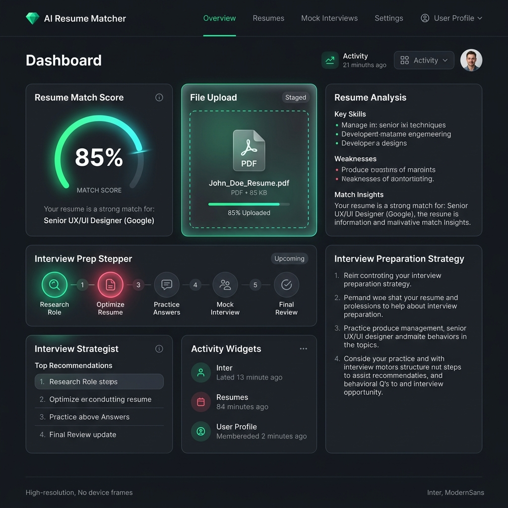
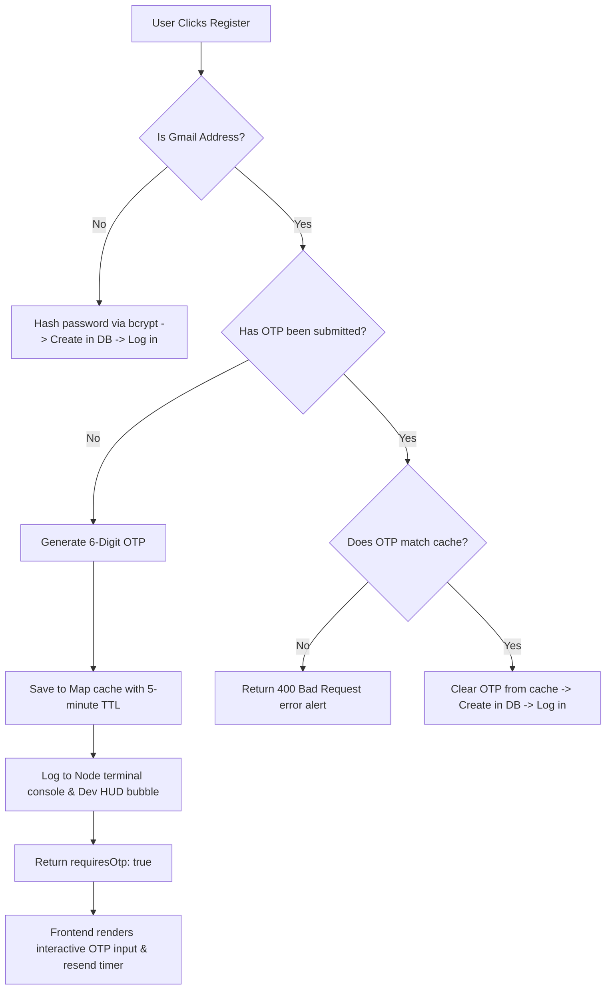
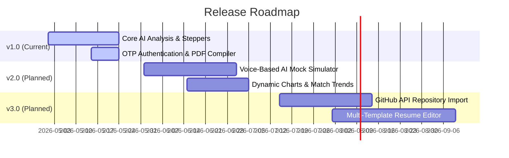

# Technical Documentation - Resume Builder GenAI & Interview Strategist (v1.0.0)

This documentation provides an in-depth technical overview of **v1.0.0 (Inaugural Release)** of the AI Resume Matcher and Interview Strategist. This initial version establishes a production-grade, highly secure, and extensible foundation for a full-scale AI-assisted candidate profiling platform.

## 🎨 Visual Representation (Dashboard Mockup)



---

## 🧭 1. Project Vision & Core Intent

v1.0.0 aims to solve the gap between static resumes and dynamic job descriptions by utilizing Google's Gemini 1.5 Flash Model to extract semantic matching metrics, structure detailed prep guidelines, and render dynamic resume documents. 

This release focuses on:
* High-security session exchanges (secure cross-site cookies, JWT).
* Strict data whitelisting (Gmail OTP security flow).
* Real-time UX pacing (Animated Thinking Steppers).
* Clean programmatic PDF rendering.

---

## 💻 2. Technical Stack Specifications

### Frontend Client
* **Core**: React 18, Vite 8 (Hot Module Replacement active).
* **Router**: React Router v6 (featuring declarative `<Protected>` session route checking).
* **Styling**: Modular SCSS (featuring responsive grid systems and CSS keyframe animations).
* **API Client**: Axios (featuring dynamic base URL targets and cookies verification support).

### Backend Server
* **Core**: Node.js, Express.js (Express 5.2 engine featuring native Promise rejection catching).
* **Database Object Modeling**: Mongoose 9 (MongoDB).
* **Generative AI SDK**: `@google/genai` (utilizing Gemini-1.5-Flash).
* **PDF Compiler**: Puppeteer 24 (Headless Chrome browser automation).
* **Parser**: `pdf-parse` (binary buffer parsing for PDF text extraction).
* **Middleware**: `cookie-parser` (JWT decryption), `cors` (dynamic origin whitelisting), `multer` (multipart disk staging).

---

## 🏛️ 3. Database Schema Models

### User Schema (`user.model.js`)
Stores basic credential profiles featuring database-level match regex:
```javascript
const userSchema = new mongoose.Schema({
    username: {
        type: String,
        unique: [ true, "username already taken" ],
        required: true,
    },
    email: {
        type: String,
        unique: [ true, "Account already exists with this email address" ],
        required: true,
        match: [
            /^[a-zA-Z0-9._%+-]+@[a-zA-Z0-9.-]+\.[a-zA-Z]{2,}$/,
            "Please provide a valid email address"
        ]
    },
    password: {
        type: String,
        required: true
    }
});
```

### Interview Report Schema (`interviewReport.model.js`)
Persists the AI structured preparation records linked to the specific candidate:
```javascript
const interviewReportSchema = new mongoose.Schema({
    userId: {
        type: mongoose.Schema.Types.ObjectId,
        ref: "users",
        required: true
    },
    jobDescription: {
        type: String,
        required: true
    },
    selfDescription: String,
    matchScore: {
        type: Number,
        required: true
    },
    strengths: [ String ],
    weaknesses: [ String ],
    technicalQuestions: [
        {
            question: String,
            answerHint: String
        }
    ],
    behavioralQuestions: [
        {
            question: String,
            answerHint: String
        }
    ],
    roadmap: [
        {
            day: String,
            focusTopic: String,
            tasks: [ String ] // Array of structured milestones
        }
    ],
    createdAt: {
        type: Date,
        default: Date.now
    }
});
```

---

## 🔁 4. Core System Workflows

The application workflow is divided into three key pipelines:

### Pipeline A: Registration & Gmail OTP Handshake
To prevent spam accounts and verify real candidates, Gmail registrations are intercepted by a secure memory-based cache handshake:



### Pipeline B: Resume & Job Analysis Flow
1. **Intake**: Candidate uploads their PDF resume and inputs the Job Description.
2. **Text Extraction**: The Express backend uses `multer` to stage the PDF, then reads the binary buffer using `pdf-parse` to extract clean, unformatted string text.
3. **Structured Gemini Call**: The server passes both the extracted resume text and the job description to Gemini 1.5. To ensure structured compliance, we force Gemini to respond in a strict schema shape using a **Native JSON Schema Definition**:
   ```javascript
   const responseSchema = {
       type: "OBJECT",
       properties: {
           matchScore: { type: "INTEGER" },
           strengths: { type: "ARRAY", items: { type: "STRING" } },
           weaknesses: { type: "ARRAY", items: { type: "STRING" } },
           technicalQuestions: {
               type: "ARRAY",
               items: {
                   type: "OBJECT",
                   properties: { question: { type: "STRING" }, answerHint: { type: "STRING" } }
               }
           },
           // behavioralQuestions & roadmap follow same pattern...
       }
   };
   ```
4. **UX Stepper Pacing**: While the API fetches data, the React client loops through a **5-Phase Stepper** (minimum 4 seconds pacing loop) to show dynamic phase indicators (parsing resume, calculating matches, structuring timelines).
5. **Persistence**: The server saves the structured JSON report to MongoDB Atlas and returns it to the client. The client renders the Match Score dial, collapsible technical/behavioral guides, and a day-by-day roadmap timeline.

### Pipeline C: Dynamic Resume PDF Compiler (Puppeteer)
1. Candidate requests a tailored resume PDF based on matching scores and guidelines.
2. The backend launches a headless browser: `puppeteer.launch({ args: ['--no-sandbox'] })`.
3. Opens a new tab, injects a tailored HTML resume template (styled with CSS resets), and inserts candidate matching parameters.
4. Converts the tab content into a high-fidelity PDF: `page.pdf({ format: 'A4', printBackground: true })`.
5. Closes the browser cleanly and pipes the PDF binary stream as a direct attachment file download to the browser client.

---

## 📦 5. Key codebase Modules

* **`auth.controller.js`**: Oversees session creation. Features environment-aware cookie exchange rules:
  - **Development Mode**: Standard cookie parameters.
  - **Production Mode**: Cross-site, secure configurations (`httpOnly`, `secure: true`, `sameSite: 'none'`), enabling cross-domain session persistence (e.g. Vercel client calling Render API).
* **`app.js`**: Registers routes and configures dynamic whitelisting CORS options. Allows any subdomain ending with `.vercel.app` to connect, securing deployment.
* **`register.jsx`**: Controls registrations. Manages active countdown timers, numeric keypad entry models, and a helpful **Developer Assistant HUD bubble** for smooth testing cycles.
* **`useAuth.js`**: Core authentication hook. Intercepts backend status updates and exposes verbose error messages (like `Network Error` or `Invalid credentials`) directly to forms.

---

## 🗺️ 6. Future Release Roadmap (v2.0 & Beyond)

As we build upon this version 1.0 foundation, the following high-impact features are slated for upcoming releases:



### v2.0 Roadmap:
1. **Interactive AI Voice Mock Simulator**:
   - Introduce an interactive audio panel that reads out Gemini's technical questions.
   - Capture user audio input via standard browser WebRTC APIs, send it to the backend for speech-to-text conversion, and have Gemini score their answers in real-time.
2. **Dynamic Progress Tracking & Match Analytics**:
   - Replace simple lists with interactive, dynamic charts (such as Chart.js or Recharts) showing match-score progression over time as users optimize their resumes for different job descriptions.

### v3.0 Roadmap:
1. **One-Click Project Imports (GitHub Integration)**:
   - Allow candidates to link their GitHub profile.
   - Fetch active repositories and automatically write descriptive project summaries with tech tags, appending them directly to the dynamically generated resume.
2. **Multi-Template Visual Editor**:
   - Provide alternative visual themes (Modern, Minimalist, Academic, Executive) for Puppeteer pdf outputs, featuring color-customization panels.
